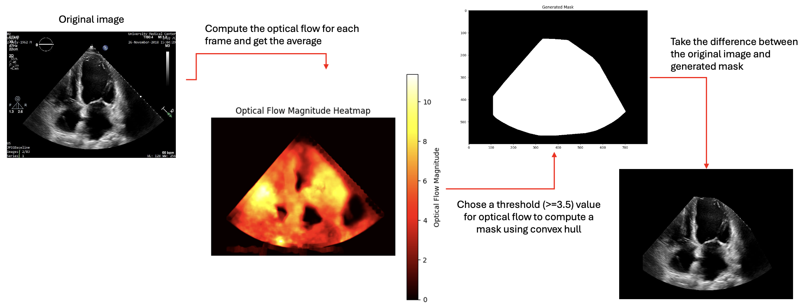

🫀 EchoNet-Dynamic: Ejection Fraction Classification & Transfer Learning
=========================================================================

This repository consolidates two stages of a research pipeline leveraging the EchoNet-Dynamic dataset for cardiac function analysis:

1. **Stage 1:** Classification of left ventricular ejection fraction (LVEF) from echocardiogram videos.
2. **Stage 2:** Transfer learning to smaller clinical datasets.

📊 Dataset Overview
-------------------

This project leverages two distinct datasets across its two stages:

1. **EchoNet-Dynamic (Source Dataset)**  
   - **Source**: Stanford University School of Medicine  
   - **Content**: 10,030 apical-4-chamber echocardiogram videos  
   - **Annotations per video**:
     - Left ventricular ejection fraction (EF)
     - End-systolic volume (ESV)
     - End-diastolic volume (EDV)
     - Expert tracings of the left ventricle at key phases
   - **Format**: Videos are standardized to 112×112 pixels, grayscale, and de-identified

2. **LVAD Clinical Dataset (Target Dataset for Transfer Learning)**  
   - **Content**: 34 patient records from a hospital cohort undergoing Left Ventricular Assist Device (LVAD) implantation  
   - **Task**: Binary classification  
     - 1 = Patient died post-implantation  
     - 0 = Patient survived  
   - **Challenge**: Extremely limited sample size, high clinical relevance  
   - **Objective**: Leverage pretrained representations from the source domain to improve predictive power in this data-scarce setting

🎯 Stage 1: EF Classification
------------------------------

The goal of Stage 1 is to classify echocardiogram videos into:

- **Normal EF:** EF ≥ 50%
- **Reduced EF:** EF < 50%

This helps in diagnosing heart failure with reduced ejection fraction (HFrEF).

We evaluated ResNet18 and ResNet152 architectures across multiple video input sizes:

ResNet18 Results
----------------
| Input Size    | Train Acc | Val Acc | Test Acc | AUROC | AUPRC |
|---------------|-----------|---------|----------|--------|--------|
| 28x28         | 0.97      | 0.87    | 0.85     | 0.87   | 0.83   |
| 56x56         | 0.93      | 0.87    | 0.87     | 0.90   | 0.87   |
| 112x112       | 0.92      | 0.88    | 0.87     | 0.90   | 0.88   |
| 28x28 (w)     | 0.94      | 0.83    | 0.81     | 0.85   | 0.80   |
| 56x56 (w)     | 0.92      | 0.86    | 0.85     | 0.90   | 0.86   |
| 112x112 (w)   | 0.94      | 0.88    | 0.86     | 0.88   | 0.86   |

ResNet152 Results
-----------------
| Input Size    | Train Acc | Val Acc | Test Acc | AUROC | AUPRC |
|---------------|-----------|---------|----------|--------|--------|
| 28x28         | 0.87      | 0.86    | 0.88     | 0.88   | 0.72   |
| 56x56         | 0.92      | 0.87    | 0.86     | 0.89   | 0.75   |
| 112x112       | 0.98      | 0.86    | 0.85     | 0.84   | 0.68   |

Notes:
- (w) = weighted evaluation under class imbalance.
- Trainable Parameters: ResNet18 ~66.35M, ResNet152 ~236.19M
- Training Epochs: 2–9, Batch Sizes: 8 or 16

📌 Conclusion (Stage 1)
-----------------------

- Smaller models (e.g., ResNet18) can match the performance of larger networks like ResNet152.
- Class weighting did not provide a significant boost in performance.
- Compact models offer a computationally efficient solution for clinical deployment.

🧠 Stage 2: Transfer Learning to Smaller Clinical Datasets
-----------------------------------------------------------

Building on Stage 1, we extend the trained model to perform transfer learning on smaller survival datasets. This is critical for real-world hospital settings where data is limited.

🧹 Step 1: Image Preprocessing via Optical Flow
-----------------------------------------------

To mimic the original echonet dataset structure, we apply a masking pipeline using optical flow to localize motion-heavy cardiac regions.

Steps:
- Load grayscale frames from echocardiogram videos
- Compute dense optical flow between consecutive frames
- Calculate the average flow magnitude across all frames
- Generate a convex hull over high-motion pixels
- Mask out non-cardiac regions and save the result

📸 Motion Masking Example

🧠 Step 2: Transfer Learning with Echonet Weights 
-----------------------------------------------

In the second stage of this project, we applied transfer learning by leveraging weights pre-trained on the EchoNet-Dynamic dataset. These were used to initialize a model and fine-tune it on a **small LVAD dataset (34 samples)**, aiming to classify whether a patient with a Left Ventricular Assist Device (LVAD) would survive (0) or die (1).

🏋️ Training Configuration

- **Task**: Binary classification (LVAD patient mortality)
- **Transfer strategy**: Fine-tune on small dataset using weights from the first stage
- **Architecture**: Pre-trained CNN + Fully connected layers
- **Parameters tuned**: Fully connected dropout / CNN dropout / L1 regularization
- **Cross-validation**: Evaluated under 2, 3, 5, and 7-fold splits

📊 Performance Summary
-----------------------------------------------

|   K-Fold | Model   | Dropout/Reg   | Test Acc (±)   | Train Acc (±)   | Test AUROC (±)   | Train AUROC (±)   | Test AUPRC (±)   | Train AUPRC (±)   |
|----------|---------|---------------|----------------|-----------------|------------------|-------------------|------------------|-------------------|
|        7 | (b)     | 0.8/0.1/0.8   | 0.700 ± 0.173  | 0.790 ± 0.124   | 0.690 ± 0.329    | 0.895 ± 0.059     | 0.530 ± 0.441    | 0.719 ± 0.086     |
|        5 | (b)     | 0.9/0.1/0.9   | 0.733 ± 0.160  | 0.816 ± 0.123   | 0.760 ± 0.434    | 0.884 ± 0.153     | 0.758 ± 0.398    | 0.720 ± 0.243     |
|        3 | (b)     | 0.8/0.095/0.8 | 0.629 ± 0.328  | 0.599 ± 0.384   | 0.698 ± 0.233    | 0.798 ± 0.054     | 0.422 ± 0.320    | 0.617 ± 0.053     |
|        2 | (b)     | 0.8/0.3/0.8   | 0.794 ± 0.042  | 0.829 ± 0.040   | 0.548 ± 0.068    | 0.690 ± 0.118     | 0.442 ± 0.002    | 0.455 ± 0.267     |

📌 Observations

- Best performance in terms of **AUROC and AUPRC** was observed with 5-fold training (AUROC = 0.76, AUPRC = 0.76).
- **Higher dropout** consistently helped reduce overfitting.
- Variance across folds (standard deviation) was larger for smaller splits, as expected with limited data.

💻 Computational Environment
----------------------------

All experiments and model training were conducted in **Kaggle Notebooks** using a standardized runtime environment. This GitHub repository contains the core components necessary for reproducibility.
- Preprocessing scripts
- Core classification/transfer utilities
- Model definitions
